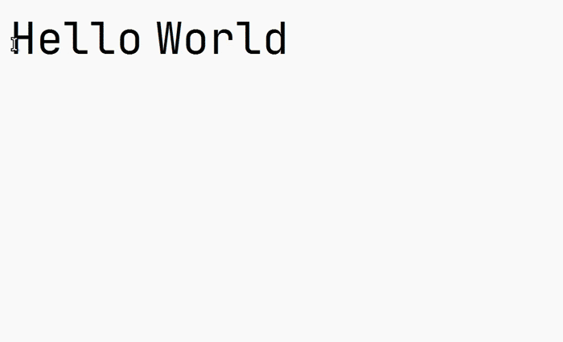
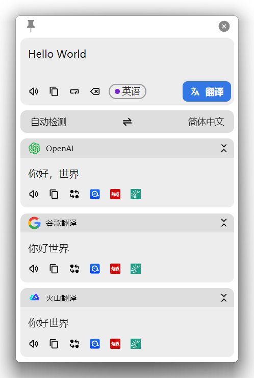

<p align="center">
  
</p>

<h1 align="center">NeoPot</h1>

<p align="center">
  面向 Windows 和 Linux 的划词翻译、输入翻译、截图 OCR 与截图翻译工具。
</p>

<p align="center">
  <a href="README.en.md">English</a>
  |
  <span>简体中文</span>
</p>

<p align="center">
  <a href="https://github.com/shirumesu/NeoPot/releases/latest">下载最新版</a>
  |
  <a href="https://github.com/shirumesu/NeoPot/issues">反馈问题</a>
</p>

<p align="center">
  
  
  
  
  
</p>

> NeoPot 基于 Pot Desktop 继续维护，并迁移到 Electron、HeroUI 和 TypeScript。
> macOS 版本暂不发布。原因是 macOS 分发需要 Apple Developer 账号；当前安装说明只面向 Windows 与 Linux。
> 目前早期开发版本重心在移植重构和功能更新，仍可能沿用部分 pot desktop 资源或是网站，后续会尽快逐步移除替换。

## 目录

- [功能预览](#功能预览)
- [主要功能](#主要功能)
- [支持接口](#支持接口)
- [安装](#安装)
- [插件系统](#插件系统)
- [外部调用](#外部调用)
- [Wayland 支持](#wayland-支持)
- [开发与构建](#开发与构建)
- [未来TODO](#未来TODO)
- [已知问题](#已知问题)
- [致谢](#致谢)

## 功能预览

| 划词翻译                                                    | 输入翻译                                                    | 外部调用                                                    |
| ----------------------------------------------------------- | ----------------------------------------------------------- | ----------------------------------------------------------- |
| 选中文字后按下快捷键翻译                                    | 呼出翻译窗口后输入文本并回车                                | 通过本地 HTTP 接口被其他工具调用                            |
|  |  |  |

| 剪贴板监听                                                    | 截图 OCR                                                     | 截图翻译                                                    |
| ------------------------------------------------------------- | ------------------------------------------------------------ | ----------------------------------------------------------- |
| 开启监听后复制文本即可翻译                                    | 框选屏幕区域并识别文字                                       | 框选屏幕区域并翻译识别结果                                  |
|  |  |  |

<p align="center">
  
  
  
</p>

## 主要功能

- 多接口并行翻译
- 本地模型文字识别
- 插件语音合成
- 截图 OCR 与截图翻译
- 剪贴板监听翻译
- 本地 HTTP 外部调用
- 插件扩展系统
- Windows 与 Linux 支持
- Wayland 外部截图调用方案
- 多语言界面

## 支持接口

当前 Electron 版内置接口如下；更多翻译、OCR 与语音合成能力通过插件扩展。

<details>
<summary>翻译</summary>

- OpenAI
- 智谱 AI
- Gemini Pro
- Ollama
- Google
- DeepL

</details>

<details>
<summary>文字识别</summary>

- 本地模型 OCR（PaddleOCR.js PP-OCRv5）

</details>

<details>
<summary>语音合成</summary>

- 仅插件

</details>

## 安装

请前往 [Releases](https://github.com/shirumesu/NeoPot/releases) 下载对应系统和架构的安装包。

### Windows

- `NeoPot-Setup-{version}.exe`: 64 位 Windows 安装包
- `NeoPot-{version}-portable-x64.exe`: 64 位 Windows 便携版

### Linux

发布页会提供 `deb`、`rpm` 和 `AppImage` 包。Debian/Ubuntu 可以直接安装下载到本地的 deb 文件：

```bash
sudo apt-get install ./neopot_{version}_amd64.deb
```

Arch、Manjaro、Flatpak、Homebrew、Winget 等分发入口尚未接入 NeoPot，请以 GitHub Releases 为准。

## 插件系统

NeoPot 支持安装 `.zip` / `.npot` 插件包或本地插件目录。兼容能力和限制见 [Electron 兼容能力表](docs/electron-compat.md)。

## 外部调用

NeoPot 提供本地 HTTP 接口，默认端口为 `60828`，可在设置中修改。

```text
POST "/"                                  翻译请求体中的文本
GET  "/config"                            打开设置
POST "/translate"                         翻译请求体中的文本
GET  "/selection_translate"               划词翻译
GET  "/input_translate"                   输入翻译
GET  "/ocr_recognize"                     截图 OCR
GET  "/ocr_translate"                     截图翻译
GET  "/ocr_recognize?screenshot=false"    使用外部截图文件进行 OCR
GET  "/ocr_translate?screenshot=false"    使用外部截图文件进行截图翻译
```

示例：

```bash
curl "127.0.0.1:60828/selection_translate"
```

### 使用外部截图工具

1. 使用其他截图工具截图。
2. 将截图保存为 `$CACHE/neopot/pot_screenshot_cut.png`。
3. 请求 `127.0.0.1:60828/ocr_recognize?screenshot=false` 或 `127.0.0.1:60828/ocr_translate?screenshot=false`。

Windows 缓存目录示例：

```text
%LOCALAPPDATA%\neopot\pot_screenshot_cut.png
```

Linux Flameshot 示例：

```bash
rm ~/.cache/neopot/pot_screenshot_cut.png \
  && flameshot gui -s -p ~/.cache/neopot/pot_screenshot_cut.png \
  && curl "127.0.0.1:60828/ocr_recognize?screenshot=false"
```

### SnipDo

Windows 用户可以从 Microsoft Store 安装 SnipDo，然后在 NeoPot Releases 中下载 `neopot.pbar` 扩展并双击安装。

## Wayland 支持

Linux 全局快捷键在 Wayland 下可能受桌面环境限制。Wayland 用户可以通过桌面环境或窗口管理器绑定快捷键，再用 `curl` 调用 NeoPot 的本地 HTTP 接口。

Hyprland 外部截图示例：

```conf
bind = ALT, X, exec, grim -g "$(slurp)" ~/.cache/neopot/pot_screenshot_cut.png && curl "127.0.0.1:60828/ocr_recognize?screenshot=false"
bind = ALT, C, exec, grim -g "$(slurp)" ~/.cache/neopot/pot_screenshot_cut.png && curl "127.0.0.1:60828/ocr_translate?screenshot=false"
```

浮动窗口示例：

```conf
windowrulev2 = float, class:(neopot), title:(Translator|OCR|Screenshot Translate)
windowrulev2 = move cursor 0 0, class:(neopot), title:(Translator|Screenshot Translate)
```

## 开发与构建

已验证环境：

- Node.js `>= 24.0.0`
- pnpm `>= 9`

拉取代码：

```bash
git clone https://github.com/shirumesu/NeoPot.git
cd NeoPot
pnpm install
```

Linux 构建依赖示例：

```bash
sudo apt-get install -y \
  libgtk-3-dev \
  libwebkit2gtk-4.0-dev \
  libayatana-appindicator3-dev \
  librsvg2-dev \
  patchelf \
  libxdo-dev \
  libxcb1 \
  libxrandr2 \
  libdbus-1-3
```

常用命令：

```bash
pnpm dev
pnpm lint
pnpm test
pnpm make
```

## 未来TODO

- [ ] 验证每个具体的服务，修改/删除/维护

## 致谢

NeoPot 源自 [Pot Desktop](https://github.com/pot-app/pot-desktop)，并继续沿用 GPL-3.0-only 许可。感谢原项目及插件生态的长期积累。
